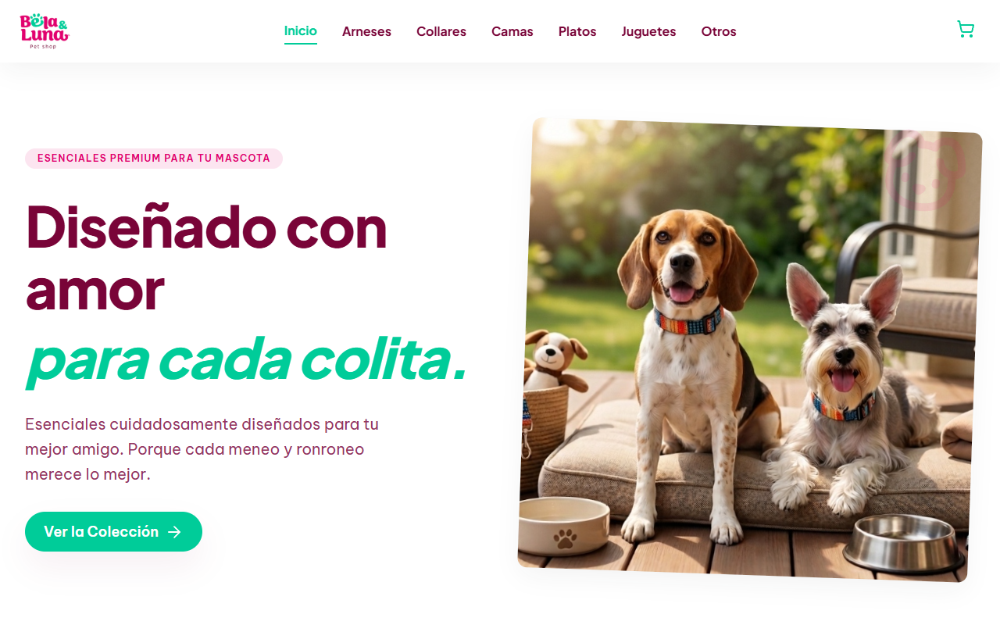
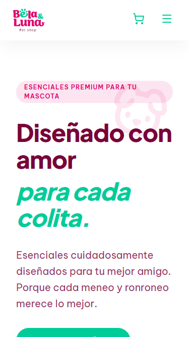
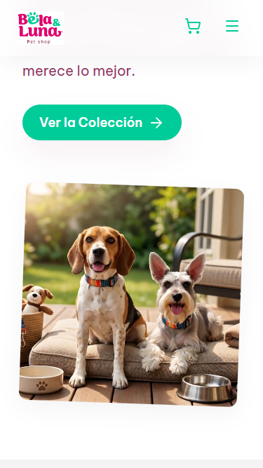

# Bela & Luna Petshop

<div align="center">
  
  <p><em>Vista de la tienda en escritorio (Ejemplo, reemplazá esta imagen)</em></p>
  
  <div style="display: flex; justify-content: center; gap: 20px;">
    
    
  </div>
  <p><em>Vista móvil y carrito de compras</em></p>
</div>

Una tienda en línea moderna y amigable dedicada a consentir a tus mascotas con los mejores accesorios. En Bela & Luna Petshop, elegimos cuidadosamente cada accesorio para ofrecerte productos que destacan por su calidad, confort y estilo, porque tu mascota merece lo mejor en cada detalle.

## Características Principales

- **Catálogo de Productos:** Organizado por categorías intuitivas (Arneses, Collares, Camas, Comederos, Juguetes y Otros).
- **Animaciones Interactivas:** Detalles encantadores como huellas de perritos que aparecen al interactuar o desplazarse por la página.
- **Carrito de Compras:** Funcionalidad del lado del cliente para agregar artículos al carrito.
- **Checkout Frontend:** Flujo de proceso de pago implementado a nivel visual y de interfaz de usuario.
- **Diseño Responsivo:** Completamente adaptable a dispositivos móviles, tablets y pantallas de escritorio.
- **Arquitectura CSS:** Uso de metodologías como BEM y CSS puro (HTML5 y CSS3 nativo, sin frameworks como Tailwind o Bootstrap).

## Tecnologías Utilizadas

- **Frontend:** React, HTML5, Vanilla CSS3 (metodología BEM), JavaScript
- **Herramientas de Construcción:** Vite
- **Backend/API:** Node.js, Express

## Instalación y Ejecución

**Requisitos previos:** Asegúrate de tener Node.js (v18 o superior) instalado.

1. Clona el repositorio e ingresa a la carpeta del proyecto.
2. Instala las dependencias:
   ```bash
   npm install
   ```
3. Ejecuta el servidor de desarrollo:
   ```bash
   npm run dev
   ```
4. Abre tu navegador en la URL indicada por Vite (normalmente `http://localhost:5173/`).

## Paleta de Colores y UI

**Colores Principales:**
- Blanco: `#FFFFFF`
- Verde: `#00CC99`
- Rosado: `#E2006E`
- Café: `#790438`

**Colores Secundarios:**
- Morado: `#8C52FF`
- Amarillo: `#FFEE88`
- Celeste: `#00C2CB`
